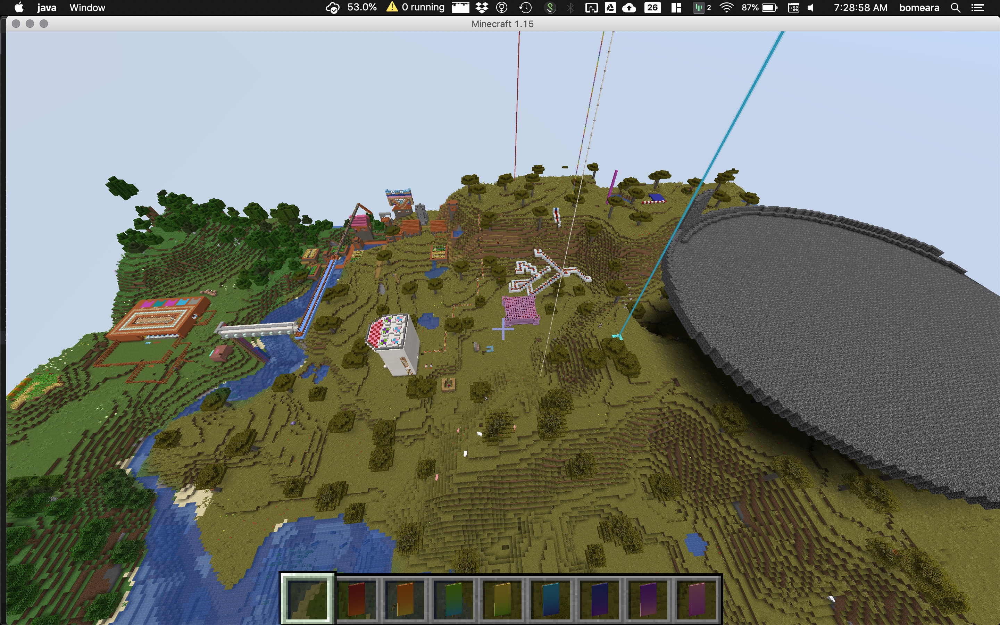
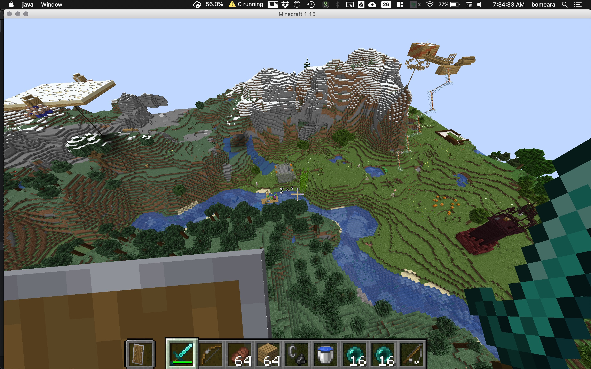

# minecraftservers
Docker compose files so my kids can play minecraft on a local server

Based on https://hub.docker.com/r/itzg/minecraft-server/

Go into the the relevant directory (vanilla, etc.) and then do `docker-compose up -d`

Based on the compose files, worlds will be saved in the relevant dir in dropbox

Other users on the local network can then join via your computer name: `omearalab24.local` for my laptop, for example.

You might want to copy whitelist.json to ops.json

## Update Aug 2019

Using bare metal servers turns out to have less lag. For those, I'm using this repo to store the save files as well. For those, ./script.sh to start

# Servers and info

## mcvanilla_blownuphouse2_1.15_Dec2019

Version 1.15

## mcvanilla_eb_1.15_Dec2019

Battle arena

Version 1.15

Renders made with [overviewer](https://overviewer.org/) (go to Minecraft-Overviewer github repo). Run makeOverviews.R within R to create the files.
